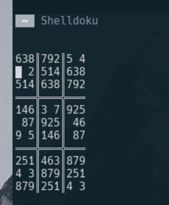

# Shelldoku
sudoku in terminal. 
All formatting and movement in ASCII


# Shelldoku generator
sudoku generator


# Build and install
```
git clone https://github.com/WouterServaes/Shelldoku.git
cd Shelldoku
mkdir build
cd build
cmake ..
sudo cmake --build . --target install
```

# Libraries
## Sudoku Difficulty
rates a sudoku according to rules.
Easy-normal-hard.
## Sudoku Generator
generates a solveable sudoku in different ways.
current options: shift/shuffle
## Sudoku Parser
Parsing sudoku to a file.
Current format: ascii,
layout: difficulty_rating-x,x2,...,x3 
## Sudoku Solver
Solving sudoku in different ways.
Current options: bitstring

# To-do
- Use other sudokus from file instead of first one
- Add a timer
- Add info about bad sudoku when pressing ready (R)
- Improve rating
- Add difficulty selection
- Add formating for placed values

# Links
https://www.sudokuwiki.org/sudoku.htm      
https://zhangroup.aporc.org/images/files/Paper_3485.pdf
https://gist.github.com/fnky/458719343aabd01cfb17a3a4f7296797